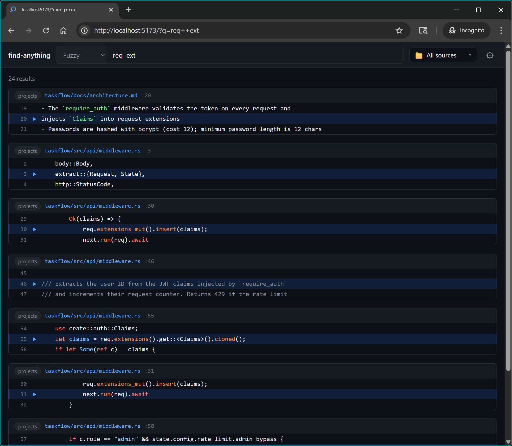
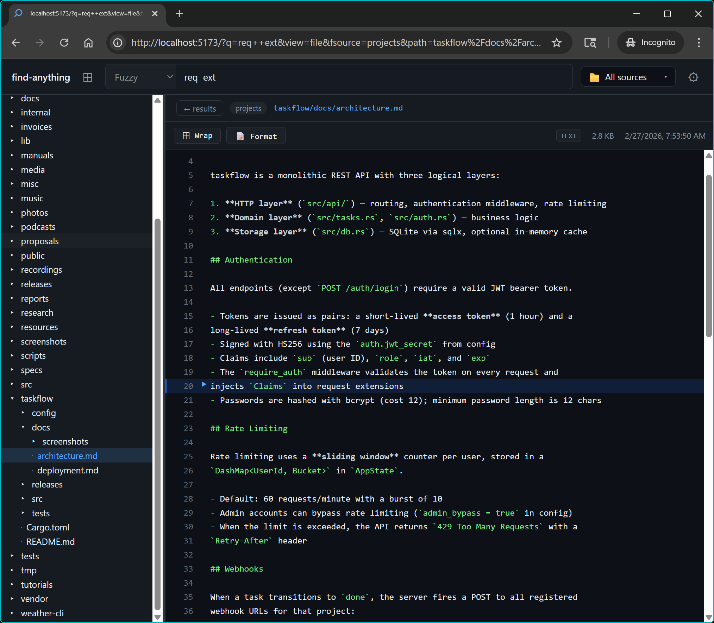
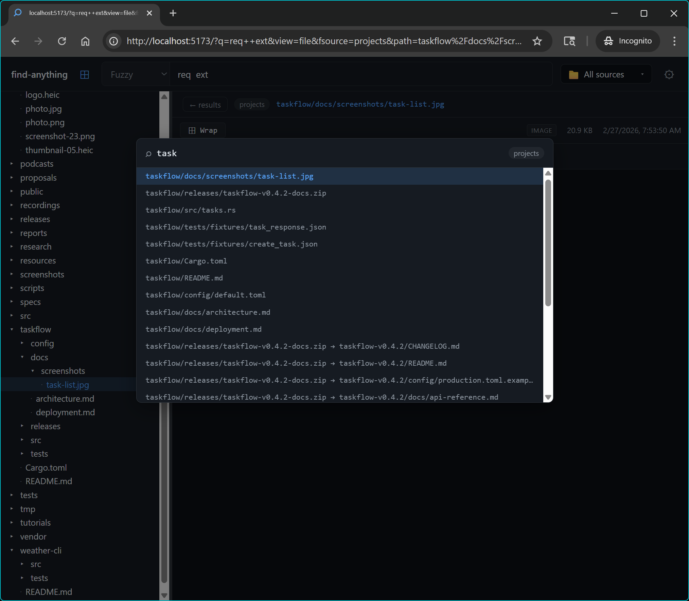
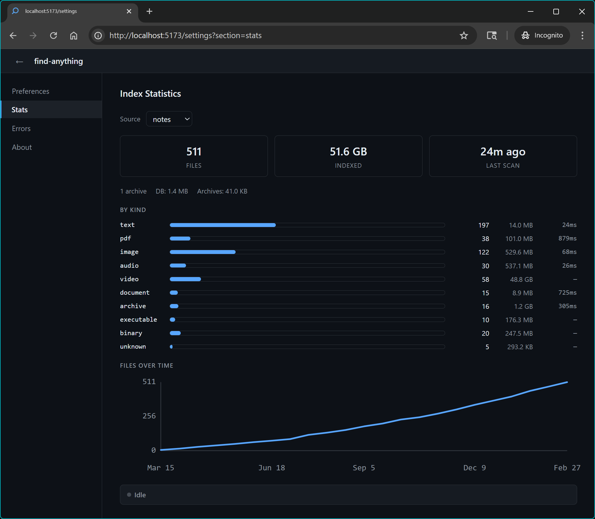

# find-anything

Distributed full-content file indexing and fuzzy search. Index one or more machines
into a central server, then query everything from a single CLI or web UI.

```
$ find-anything "password strength"
[code] src/auth/validate.rs:142  check_password_strength(input)?;
[code] docs/security.md:87       Password strength requirements: minimum 12 chars
```

**Highlights:**

- Full text search across all indexed machines from one place
- Fuzzy, exact, and regex search modes
- Find files in tree view by path/name using CTRL+P
- Archive members (ZIP, TAR, 7Z) indexed as individual searchable files
- Content deduplication — identical files stored once; search results surface all duplicate paths
- Per-directory indexing control via `.noindex` (skip subtree) and `.index` (override scan settings)
- Indexing error tracking — extraction failures surfaced in the UI per source
- Real-time updates via `find-watch`; cross-platform (Linux, macOS, Windows)

---

## Screenshots

<table>
<tr>
<td>
<details>
<summary></summary>

</details>
</td>
<td>
<details>
<summary></summary>

</details>
</td>
<td>
<details>
<summary></summary>

</details>
</td>
<td>
<details>
<summary></summary>

</details>
</td>
</tr>
</table>

---

## How it works

- A server stores the index and exposes an HTTP endpoint to add indexed files.

- Client machines run `find-scan` to do a full or incremental scan
- Client machines run `find-watch` to monitor filesystem changes and keep the index up to date
- Client command `find` can query the index, or use web UI exposed by the server

The server can run anywhere — on a home server, NAS, VPS, or your local machine.
Client tools run on each machine whose files you want to index.

---

## Installation

### Server installation (Linux & macOS)

Run on the machine that will host the central index:

```sh
curl -fsSL https://raw.githubusercontent.com/jamietre/find-anything/master/install-server.sh | sh
```

The script prints the latest version, then prompts for:

- Install directory (default: `/usr/local/bin` for system, `~/.local/bin` for user)
- Service mode: **system** (root required, dedicated user, `/etc/find-anything/`) or **user** (`~/.config/find-anything/`)
- Bind address, data directory, and bearer token (auto-generated)

It then writes an annotated `server.toml`, installs and enables the service, and
prints the token for use when configuring clients.

To install a specific version: `VERSION=v0.2.4 curl ... | sh`

To skip all prompts (e.g. in scripts): `SKIP_CONFIG=1 curl ... | sh`

### Client installation (Linux & macOS)

Run on each machine whose files you want to index:

```sh
curl -fsSL https://raw.githubusercontent.com/jamietre/find-anything/master/install.sh | sh
```

The script prints the latest version, then prompts for:

- Install directory (default: `~/.local/bin`)
- Server URL, bearer token, and directories to watch

It then writes an annotated `client.toml`, installs and enables the `find-watch`
systemd user service, and prints the `find-scan` command to run when ready.

To install a specific version: `VERSION=v0.2.4 curl ... | sh`

To skip all prompts (e.g. in scripts): `SKIP_CONFIG=1 curl ... | sh`

### Windows client

Download the installer from [GitHub Releases](https://github.com/jamietre/find-anything/releases/latest) and run it. The wizard will ask for the server URL, token, and directories to watch, then register `find-watch` as a Windows service and run the initial scan.

### Docker (server only)

```sh
git clone https://github.com/jamietre/find-anything
cd find-anything
cp examples/server.toml server.toml   # edit: set token and data_dir
docker compose up -d
```

### Build from source

```sh
git clone https://github.com/jamietre/find-anything
cd find-anything
cargo build --release
```

For cross-compilation targets (ARM7 NAS, etc.) and full dev setup, see [DEVELOPMENT.md](DEVELOPMENT.md).

---

## Binaries

| Binary                 | Role                                        | Runs on                     |
| ---------------------- | ------------------------------------------- | --------------------------- |
| `find-server`          | Central index server                        | server machine              |
| `find-scan`            | Initial filesystem indexer                  | each client machine         |
| `find-watch`           | Real-time file watcher (incremental)        | each client machine         |
| `find-anything`        | CLI search client                           | anywhere                    |
| `find-admin`           | Admin utilities: config, status, inbox mgmt | each client machine         |
| `find-extract-text`    | Text/Markdown extractor                     | client (used by find-watch) |
| `find-extract-pdf`     | PDF extractor                               | client (used by find-watch) |
| `find-extract-media`   | Image/audio/video metadata extractor        | client (used by find-watch) |
| `find-extract-archive` | ZIP/TAR/7Z extractor                        | client (used by find-watch) |
| `find-extract-html`    | HTML extractor                              | client (used by find-watch) |
| `find-extract-office`  | Office document extractor (DOCX/XLSX/PPTX)  | client (used by find-watch) |
| `find-extract-epub`    | EPUB ebook extractor                        | client (used by find-watch) |
| `find-extract-pe`      | Windows PE/DLL metadata extractor           | client (used by find-watch) |

The `find-extract-*` binaries are used by `find-watch` to extract file content
in subprocesses. They must be co-located with `find-watch` or on PATH.

---

## Quick start

### 1. Start the server

**With Docker Compose:**

```sh
cp examples/server.toml server.toml
# Edit server.toml: set a strong token value
docker compose up -d
```

**Or run directly:**

```sh
cat > server.toml <<EOF
[server]
bind     = "127.0.0.1:8080"
data_dir = "/var/lib/find-anything"
token    = "change-me"
EOF

find-server --config server.toml
```

### 2. Create a client config

```toml
# client.toml
[server]
url   = "http://127.0.0.1:8080"
token = "change-me"

[[sources]]
name  = "home"
paths = ["/home/alice/documents", "/home/alice/projects"]

[scan]
exclude = ["**/.git/**", "**/node_modules/**", "**/target/**"]
max_file_size_mb = 10
```

### 3. Run an initial scan

```sh
find-scan
```

### 4. Start the file watcher

```sh
find-watch
```

`find-watch` keeps the index current as files are created, modified, or deleted.
Run `find-scan` once first; `find-watch` does not do an initial scan on startup.

### 5. Search

```sh
find-anything "some pattern"
find-anything "some pattern" --mode exact
find-anything "fn handler" --mode regex --source home --limit 20
```

### 6. Check indexing status

```sh
find-admin status          # per-source file counts, sizes, last scan, worker state
find-admin status --json   # machine-readable
```

Extraction failures (e.g. corrupt PDFs, unreadable archives) are tracked per file and
visible in the **Settings → Errors** panel in the web UI and in the `find-admin status`
output as an error count per source.

### 7. Web UI (optional)

```sh
cd web
cp .env.example .env          # edit: set FIND_SERVER_URL and FIND_TOKEN
pnpm install
pnpm dev                      # http://localhost:5173
```

---

## Linux: running as a service

The install scripts handle systemd setup automatically. If you need to manage
the services manually, or want system-mode unit files for a multi-user server,
see [`docs/systemd/README.md`](docs/systemd/README.md).

```sh
# Server service
systemctl status find-server          # system install
systemctl --user status find-server   # user install

# Client watcher service
systemctl --user status find-watch
systemctl --user restart find-watch

# Re-run a full scan at any time
find-scan --full
```

---

## Supported file types

| Type                                 | What's extracted                                                         |
| ------------------------------------ | ------------------------------------------------------------------------ |
| Text, source code, Markdown          | Full content; Markdown YAML frontmatter as structured fields             |
| PDF                                  | Full text content                                                        |
| HTML (.html, .htm, .xhtml)           | Visible text from headings/paragraphs; title and description as metadata |
| Office (DOCX, XLSX, XLS, XLSM, PPTX) | Paragraphs, rows, slide text; document title/author as metadata          |
| EPUB                                 | Full chapter text; title, creator, publisher, language as metadata       |
| Images (JPEG, PNG, TIFF, HEIC, RAW)  | EXIF metadata (camera, GPS, dates)                                       |
| Audio (MP3, FLAC, M4A, OGG)          | ID3/Vorbis/MP4 tags (title, artist, album)                               |
| Video (MP4, MKV, WebM, AVI, MOV)     | Format, resolution, duration                                             |
| Archives (ZIP, TAR, 7Z, GZ)          | Members extracted recursively and indexed as individual searchable files |
| Windows PE/DLL                       | File version, description, company, original filename from version info  |

---

## Configuration reference

### Server (`server.toml`)

```toml
[server]
bind     = "127.0.0.1:8080"         # address to listen on
data_dir = "/var/lib/find-anything"  # index and archive storage
token    = "your-token"              # bearer token for all API requests

[search]
default_limit       = 50
max_limit           = 500
fts_candidate_limit = 2000           # FTS5 rows passed to the re-scorer
```

### Client (`client.toml`)

```toml
[server]
url   = "http://host:8080"
token = "your-token"

[[sources]]
name     = "home"
paths    = ["/home/alice/documents", "/home/alice/projects"]
base_url = "file:///home/alice"      # optional: makes results hyperlinkable

[scan]
exclude          = ["**/.git/**", "**/node_modules/**", "**/target/**"]
max_file_size_mb = 10
follow_symlinks  = false
include_hidden   = false
noindex_file     = ".noindex"   # place this file in a dir to skip it entirely
index_file       = ".index"     # place this TOML file in a dir to override scan settings for that subtree

[scan.archives]
enabled               = true
max_depth             = 10    # max nesting depth (guards against zip bombs)
max_7z_solid_block_mb = 256   # lower on memory-constrained systems (NAS, containers)

[watch]
debounce_ms   = 500               # ms of silence before processing events
extractor_dir = "/usr/local/bin"  # optional; auto-detected if omitted

[log]
# Suppress noisy log messages matching any of these regular expressions.
# Patterns are matched against "target: message" (e.g. "find_extract_pdf: ...").
# Default suppresses high-volume glyph warnings from pdf-extract.
ignore = [
    "pdf_extract: unknown glyph name",
]
```

---

## Troubleshooting

### find-watch crashes immediately

Run the binary directly to see the error output:

```sh
find-watch
```

Common causes:

- **Config file not found** — check the path; on Synology homes are under `/var/services/homes/<user>/`
- **inotify watch limit reached** — see [Synology / inotify limit](#synology-nas) below
- **Cannot connect to server** — verify the server URL and that `find-server` is running

---

### Synology NAS

#### Service setup

Synology DSM uses systemd but does not support user-level systemd sessions
(`systemctl --user`). The install script detects this and writes a system-level
unit file instead. Follow the `sudo mv` / `sudo systemctl` commands it prints.

#### inotify watch limit

When watching large directory trees, `find-watch` will fail with:

```
Error: OS file watch limit reached.
```

inotify uses one watch **per directory** (not per file). The default kernel
limit is usually 8192, which is too low for large data volumes. Raise it:

```sh
# Apply immediately (no reboot needed)
sudo sysctl -w fs.inotify.max_user_watches=524288
```

To persist across reboots, create a startup task with **Task Scheduler**:

1. Control Panel → Task Scheduler → Create → Triggered Task → User-defined script
2. Set trigger to **Boot-up**, run as **root**
3. Script:
   ```sh
   sysctl -w fs.inotify.max_user_watches=524288
   ```

Then restart the service:

```sh
sudo systemctl restart find-watch
```

#### Logs

Synology DSM does not run journald, so `journalctl` will show no entries.
To view find-watch output, run the binary directly in a terminal (see above),
or add log file output to the service unit:

```ini
# /etc/systemd/system/find-watch.service  — add under [Service]:
StandardOutput=append:/var/log/find-watch.log
StandardError=append:/var/log/find-watch.log
```

Then: `sudo systemctl daemon-reload && sudo systemctl restart find-watch`

---

## Roadmap

See [ROADMAP.md](ROADMAP.md) for the full development roadmap, including
completed features, planned work, and future ideas.
